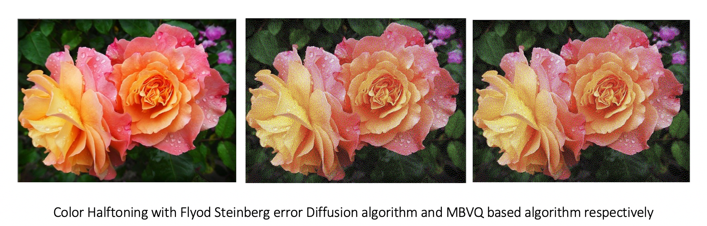
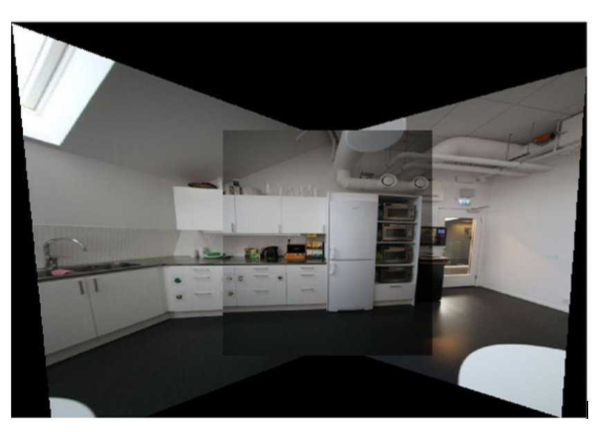
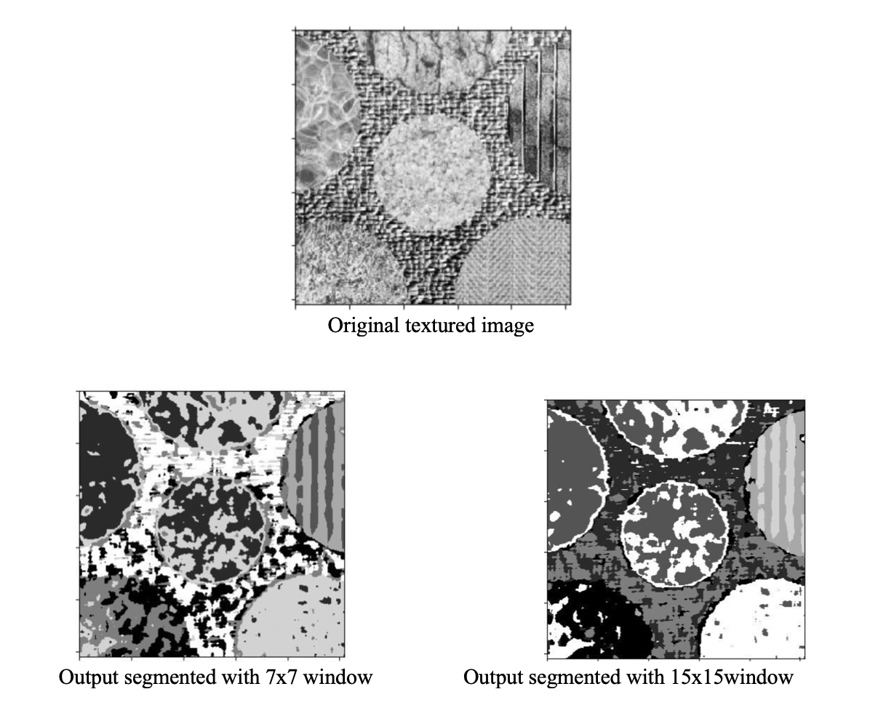
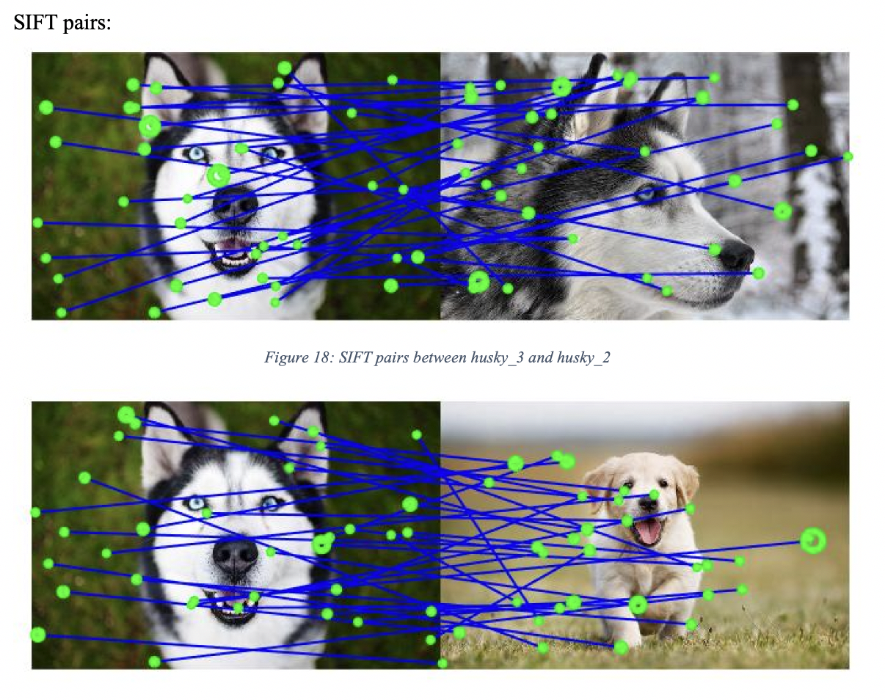
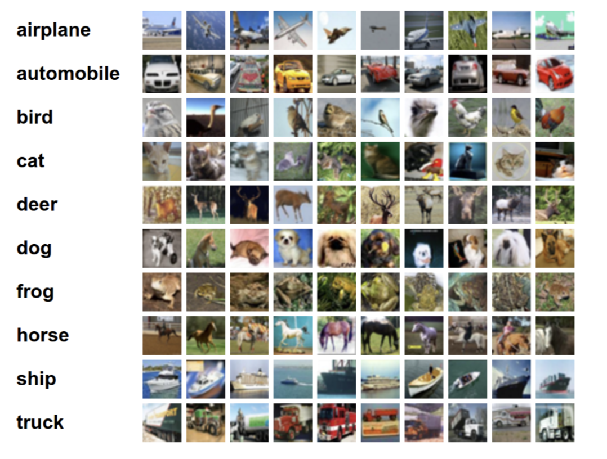
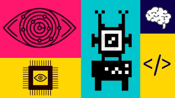

## About

Currently pursuing my MS in Electrical Engineering at University Of Southern California, I intend to focus on areas such  machine learning, AI, computer vision and embedded systems. I hope to combine my experience working as an Applications Engineer at Analog Devices added  with the skills and concepts learned in this program to rapidly will help me advance the exciting field of machine learning and computer vision. I believe my creativity, enthusiasm for the field, and maker mentality will be assets to any team I join in the future. 

## Portfolio

---

### Machine Learning

[Human Activity Recognition using Time Series Classification](https://github.com/sbsreedh/Human-Activity-Recognition-using-Time-Series-Classification)

---
[Identification of Risk of readmission of Diabetic Patients]( https://github.com/sbsreedh/Identification-of-Risk-of-readmission-of-Diabetic-patients)
<!--  -->

---
[Banknote Authentication Dataset -KNN Analysis](https://github.com/sbsreedh/Banknote-Authentication-Dataset-KNN-Analysis)
<!--  -->

---

### Computer Vision and Image Processing

#### Image Processing toolbox

- [Histogram Manipulation and Image denosing](https://github.com/sbsreedh/Color-Histogram-Manipulation-and-Image-Denoising)

- [Geometrical Modification of Images and Morphological Processing](http://example.com/)

- [Edge Detection and Digital Halftoning](https://github.com/sbsreedh/Edge-Detection-and-Digital-Halftoning)

- [Image Stitching](https://github.com/sbsreedh/Image-Stitching)

- [Texture Classification](https://github.com/sbsreedh/Texture-Classification-and-Segmentation-using-k-means-clustering)

- [Image matching and Bag Of Words](https://github.com/sbsreedh/Image-Matching-and-Bag-of-Words)

[CNN Training on LENET](https://github.com/sbsreedh/CNN-Training-on-LeNet-5)

---
### Master Computer Vision using OpenCV4 in Python-Udemy
[Computer Vision using OpenCV4](https://github.com/sbsreedh/Master-Computer-Vision-using-OpenCV4-in-Python)
 

---

Page template forked from <a href="https://github.com/evanca/quick-portfolio">evanca</a>

<!-- Remove above link if you don't want to attibute -->
